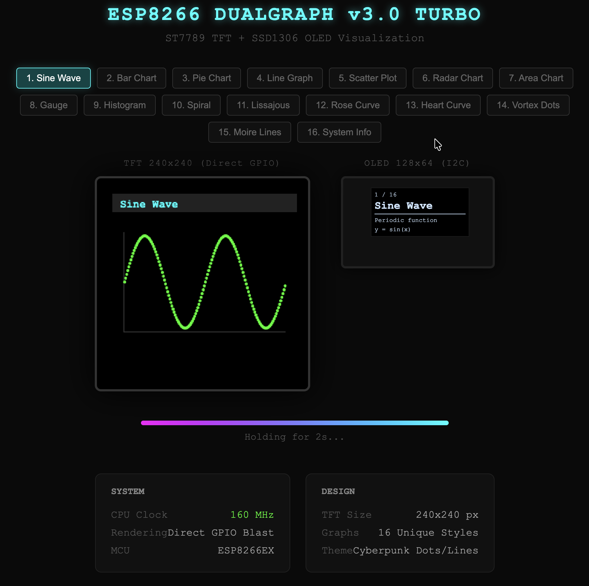

# ESP8266 Dual Display Monitor

ESP8266 NodeMCU v2 하나로 **두 개의 디스플레이**를 동시에 구동합니다.
서울 실시간 날씨와 ESP8266 시스템 정보를 **30초마다 자동 전환**하며 보여줍니다.

> **[Live Preview](https://jvisualschool.github.io/ESP8266-DualDisplay/preview.html)** - 브라우저에서 실제 화면 미리보기를 확인하세요!

---

## Screenshots

| Hardware | Weather Mode | System Mode |
|:---:|:---:|:---:|
|  |  |  |

---

## 완성 모습

### Mode 1 - Seoul Weather (30초)
```
 ┌─────────────────────┐    ┌──────────────┐
 │  Seoul Weather       │    │  15:42:30    │
 │  Cloud               │    │  2026-02-16  │
 │  -0.2'C              │    │──────────────│
 │  overcast clouds     │    │  WiFi:-42dBm │
 │─────────────────────│    │  IP:192.168..│
 │  Feel -3.1'C         │    │  Upd: 125s   │
 │  Hum  72%            │    └──────────────┘
 │  Wind 2.3m/s         │      OLED 128x64
 │  hPa  1025           │
 └─────────────────────┘
    TFT 240x240
```

### Mode 2 - ESP8266 Info (30초)
```
 ┌─────────────────────┐    ┌──────────────┐
 │  ESP8266 Info        │    │  SSID:MY_WI.. │
 │  ID  86B1C7          │    │  IP:192.168..│
 │  CPU 80 MHz          │    │  MAC:48:3F:..│
 │  ROM 4096 KB         │    │──────────────│
 │─────────────────────│    │  Heap:38KB   │
 │  HEAP 38KB           │    │  Up:2h 15m   │
 │  [██████████░░] 54%  │    └──────────────┘
 │  WiFi -42dBm         │
 │  [████████████░] 76% │
 │  UP  2h 15m 30s      │
 └─────────────────────┘
```

---

## 필요한 부품

| 부품 | 규격 | 비고 |
|------|------|------|
| ESP8266 NodeMCU v2 | HW-364A, 80MHz, 80KB RAM, 4MB Flash | OLED 내장 보드 |
| TFT 디스플레이 | ST7789, 1.54인치, 240x240, SPI | 핀헤더 납땜 필요 |
| 브레드보드 | 830홀 (일반 사이즈) | |
| 점퍼 와이어 | 수-수 (Male-Male) 8개 | |
| USB-C 케이블 | 데이터/전원 겸용 | 최초 업로드 시 필요 |

---

## 배선 방법

### 주의: 이 보드(HW-364A)는 브레드보드보다 넓습니다!

ESP8266을 브레드보드 **아래쪽으로 치우쳐서** 꽂습니다.
윗핀(D0~3V)만 F행에 들어가고, 아랫핀은 바깥으로 빠져나갑니다.
**A~E행의 같은 열**에 점퍼선을 꽂아서 TFT를 연결합니다.

```
              브레드보드
     1  2  3  4  5 ...  16     21  22
 A   ○  ○  ○  ○  ○      ○      ○   ○   ← 여기에 점퍼선!
 B   ○  ○  ○  ○  ○      ○      ○   ○
 C   ○  ●  ●  ●  ●      ●      ●   ●   ← 점퍼선 꽂는 행
 D   ○  │  │  │  │      │      │   │
 E   ○  │  │  │  │      │      │   │
     ━━━━━━━━━━━━━━━━━━━━━━━━━━━━━━━━━━
 F  [D0][D1][D2][D3][D4]...[D8]...[G][3V]  ← ESP 윗핀
 G   ■■■■■■■■■ ESP8266 보드 ■■■■■■■■■■■
 H   ■■■■■■■■■■■■■■■■■■■■■■■■■■■■■■■■■
 I   ■■■■■■■■■■■■■■■■■■■■■■■■■■■■■■■■■
 J   (아랫핀 - 바깥으로 삐져나옴, 사용 안함)
```

### TFT 핀 연결 (점퍼선 8개)

| 순서 | TFT 핀 | ESP8266 핀 | 선 색상 (권장) | 용도 |
|:---:|---------|-----------|:---:|------|
| 1 | GND | GND (G) → (-) 레일 | 검정 | 접지 |
| 2 | VCC | 3V3 (3V) → (+) 레일 | 빨강 | 전원 3.3V |
| 3 | SCL | D1 (GPIO 5) | 노랑 | SPI Clock |
| 4 | SDA | D2 (GPIO 4) | 초록 | SPI Data |
| 5 | RST | D3 (GPIO 0) | 주황 | 리셋 |
| 6 | DC | D4 (GPIO 2) | 파랑 | Data/Command |
| 7 | CS | D8 (GPIO 15) | 보라 | Chip Select |
| 8 | BL | (+) 레일 (3.3V) | 빨강 | 백라이트 ON |

### OLED (보드 내장, 배선 불필요)

| OLED | ESP8266 | 프로토콜 |
|------|---------|---------|
| SDA | D5 (GPIO 14) | I2C |
| SCL | D6 (GPIO 12) | I2C |
| 주소 | 0x3C | |

---

## 개발 환경 설정

### 1단계: ESP8266 보드 패키지 설치

```bash
arduino-cli config add board_manager.additional_urls \
  https://arduino.esp8266.com/stable/package_esp8266com_index.json

arduino-cli core install esp8266:esp8266
```

### 2단계: 라이브러리 설치

```bash
arduino-cli lib install \
  "Adafruit SSD1306" \
  "Adafruit ST7735 and ST7789 Library" \
  "Adafruit GFX Library" \
  "ArduinoJson"
```

### 3단계: WiFi 및 API 설정

`dual_monitor/dual_monitor.ino` 파일 상단을 본인 환경에 맞게 수정하세요:

```cpp
// WiFi 설정
const char* WIFI_SSID = "YOUR_WIFI_NAME";     // WiFi 이름
const char* WIFI_PASS = "YOUR_WIFI_PASSWORD";  // WiFi 비밀번호

// OpenWeatherMap 설정
const char* OWM_API_KEY = "YOUR_API_KEY";      // openweathermap.org 에서 무료 발급
const char* OWM_CITY = "Seoul";                // 도시명 (영문)
```

> **API 키 발급 방법**: [openweathermap.org](https://openweathermap.org) 가입 후
> My API Keys 에서 무료 키 발급 (하루 1,000회 호출 가능)

### 4단계: 컴파일 & 업로드

```bash
# 컴파일
arduino-cli compile --fqbn esp8266:esp8266:nodemcuv2 dual_monitor/

# 업로드 (포트는 본인 환경에 맞게 수정)
arduino-cli upload --fqbn esp8266:esp8266:nodemcuv2 \
  --port /dev/cu.usbserial-10 dual_monitor/
```

> **포트 확인**: `arduino-cli board list`로 연결된 포트를 확인하세요.

### 5단계: 동작 확인

1. USB 연결 후 TFT에 "Connecting WiFi..." 표시
2. WiFi 연결 성공 시 "WiFi OK!" + IP 주소 표시
3. 몇 초 후 날씨 데이터 로딩
4. 30초마다 날씨 ↔ 시스템 정보 자동 전환

---

## 프로젝트 구조

```
ESP8266_TFT/
│
├── dual_monitor/
│   └── dual_monitor.ino        # 메인 펌웨어 (이것만 업로드하면 됨)
│
├── dual_display_test/
│   └── dual_display_test.ino   # 디스플레이 동작 테스트용
│
├── i2c_scanner/
│   └── i2c_scanner.ino         # I2C 장치 스캔 (디버깅용)
│
├── preview.html                 # 브라우저 미리보기 (실제 화면 시뮬레이션)
└── README.md                    # 이 파일
```

---

## 기술 상세

### 왜 Software SPI를 사용하나요?

ESP8266의 Hardware SPI SCLK 핀(GPIO14/D5)이 내장 OLED의 I2C SDA 핀과 **동일**합니다.
충돌을 피하기 위해 TFT는 D1, D2를 사용한 Software SPI로 구동합니다.

| 장치 | 프로토콜 | 핀 |
|------|---------|-----|
| OLED | I2C (하드웨어) | D5(SDA), D6(SCL) - 보드 고정 |
| TFT | SPI (소프트웨어) | D1(CLK), D2(MOSI), D3(RST), D4(DC), D8(CS) |

### 화면 갱신 방식

- **TFT**: 모드 전환 시 또는 새 데이터 수신 시에만 전체 화면을 다시 그림 (Software SPI가 느리므로 깜빡임 방지)
- **OLED**: 날씨 모드에서 1초마다 시계만 갱신 (I2C는 빠르므로 부담 없음)
- **날씨 API**: 10분 간격으로 호출 (무료 플랜 일일 한도 내)

### 전원

USB-C 하나로 ESP8266 + OLED + TFT 모두 구동됩니다.

| 부품 | 소비 전류 |
|------|----------|
| ESP8266 (WiFi 활성) | ~70mA |
| SSD1306 OLED | ~20mA |
| ST7789 TFT | ~30mA |
| **합계** | **~120mA** |

ESP8266 보드의 3.3V 레귤레이터 최대 출력: ~500mA (충분)

---

## 트러블슈팅

| 증상 | 원인 | 해결 |
|------|------|------|
| TFT 화면이 안 나옴 | 배선 오류 | 핀 연결 재확인, 특히 SCL↔D1, SDA↔D2 |
| TFT 화면이 180도 뒤집힘 | 회전 설정 | `tft.setRotation(2)` → `0` 또는 `2`로 조정 |
| OLED에 이전 화면이 남음 | 초기화 순서 | TFT를 먼저 초기화한 후 OLED 초기화 |
| WiFi 연결 실패 | SSID/PW 오류 | `dual_monitor.ino` 상단 WiFi 설정 확인 |
| 날씨가 "Loading..." | API 키 오류 | OpenWeatherMap API 키 확인, 발급 후 10분 대기 |
| 한글이 깨짐 | 폰트 미지원 | Adafruit GFX 기본 폰트는 ASCII만 지원, 영문 사용 |
| 업로드 시 포트 에러 | 시리얼 모니터 점유 | `lsof /dev/cu.usbserial-*` 로 확인 후 프로세스 종료 |
| 업로드 시 보드 인식 안됨 | USB 케이블 | 데이터 전송 가능한 케이블인지 확인 (충전 전용 X) |

---

## 커스터마이징

### 모드 전환 간격 변경

```cpp
const unsigned long MODE_INTERVAL = 30000;  // 밀리초 (30000 = 30초)
```

### 날씨 업데이트 주기 변경

```cpp
const unsigned long WEATHER_INTERVAL = 600000;  // 밀리초 (600000 = 10분)
```

### 도시 변경

```cpp
const char* OWM_CITY = "Busan";  // 영문 도시명
```

### TFT 회전

```cpp
tft.setRotation(0);  // 0=0도, 1=90도, 2=180도, 3=270도
```
