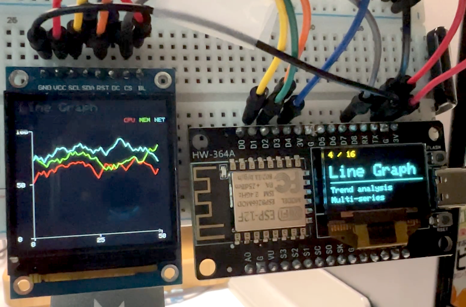

# ESP8266_DualGraph (Graph Gallery v3.0 Turbo)

ESP8266(NodeMCU v2)을 활용하여 TFT(ST7789)와 OLED(SSD1306) 듀얼 디스플레이에 16종의 하이테크 그래프를 시각화하는 프로젝트입니다. 하드웨어 레지스터 직접 제어를 통해 소프트웨어 SPI 한계를 극복하고 초고속 렌더링을 구현했습니다.

## 📸 Screenshots

<p align="center">
  
  
</p>


## 🚀 Key Features

- **Turbo Speed**: ESP8266 CPU를 160MHz로 오버클럭하여 처리 속도 극대화.
- **Instant Erase**: 하드웨어 레지스터(GPOS, GPOC) 직접 조작을 통한 `fastClear()` 구현 (줄 단위 삭제 현상 제거).
- **Dual Display**: 
  - **TFT (240x240)**: 메인 그래프 애니메이션 시각화.
  - **OLED (128x64)**: 그래프 이름, 설명 및 실시간 상태 표시.
- **16 Animation Types**: 
  - Sine Wave, Bar Chart(Bottom-up), Pie Chart, Line Graph(Multi-series), Scatter Plot, Radar Chart(Growing), Area Chart(Premium Gradient), Gauge, Histogram, Spiral, Lissajous, Rose Curve, Heart Curve, Vortex Dots, Moiré Lines, System Info.
- **Premium Aesthetics**: Cyan, Magenta, Deep Purple 등을 활용한 세련된 컬러 테마 및 도트/라인 중심의 고해상도 디자인.

## 🛠 Hardware Setup

| Component | Pin (ESP8266) | Description |
|-----------|---------------|-------------|
| **TFT CS** | GPIO 15 (D8) | CS |
| **TFT DC** | GPIO 2 (D4) | Data/Command |
| **TFT RST**| GPIO 0 (D3) | Reset |
| **TFT SCLK**| GPIO 5 (D1) | Serial Clock |
| **TFT MOSI**| GPIO 4 (D2) | Data In |
| **OLED SDA**| GPIO 14 (D5) | I2C Data |
| **OLED SCL**| GPIO 12 (D6) | I2C Clock |

## 💻 Technical Details

- **CPU Frequency**: 160MHz (`system_update_cpu_freq(SYS_CPU_160MHZ)`)
- **Fast Plotting**: `yield()` 관리를 통한 WDT 리셋 방지 및 루프 언롤링(Loop Unrolling)을 통한 SPI 데이터 전송 최적화.
- **Coordinate System**: 하단 X축 기준 상향식(Bottom-up) 렌더링 로직 적용.

## 🛠 Compilation & Upload

본 프로젝트는 `arduino-cli`를 사용하여 빌드 및 업로드가 가능합니다.

```bash
# Compile
arduino-cli compile --fqbn esp8266:esp8266:nodemcuv2 graph_gallery/

# Upload
arduino-cli upload --fqbn esp8266:esp8266:nodemcuv2 --port /dev/cu.usbserial-10 graph_gallery/
```

## 👨‍💻 Developer
- **User**: jvisualschool
- **Assistant**: Antigravity (Advanced Agentic Coding AI)

## 📄 License
MIT License
